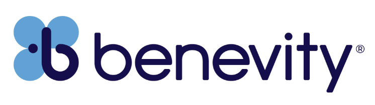

<h1 align="center">Hi 👋, I'm Sunny Panchal</h1>
<h3 align="center">
  AI Systems Engineer @ Benevity | GenAI & ML Engineer | Data Scientist  
  <em>Automating today so we can innovate tomorrow.</em>
</h3>

---
<!-- Career Logos -->

  
  &nbsp;&nbsp;
  
  &nbsp;&nbsp;
  
  &nbsp;&nbsp;
  

---

## 🚀 About Me
I’m an **AI Systems Engineer** with a background in **Generative AI, Machine Learning, and Data Science**, building **enterprise-grade AI solutions** that scale.  
I specialize in **Agentic AI workflows, RAG systems, and ML pipelines** — bridging raw data chaos into business-ready automation.  

- 🎯 **Current:** Building **Agentic GenAI systems** at **Benevity** to power CSR, ESG, and employee engagement.  
- 🏎 **Past @ Honda:** Deployed ML models for **Warranty Claim Classification**, **PDCA AI Summaries**, and **MDM Customer Matching**.  
- 🌍 **Experience:** From **healthcare AI** at BOH Pharma to **enterprise AI systems** at LTIMindtree & Honda.  

---

## 🛠️ Tech Stack

**GenAI & LLMs:**  
LangChain • LangGraph • Ollama • Azure OpenAI • Watsonx.ai • Llama • Gemma • RAG • LLMOps  

**ML Engineering:**  
Python • scikit-learn • XGBoost • TensorFlow • PyTorch • Spark • Databricks  

**MLOps & DevOps:**  
GitHub Actions • Jenkins • Docker • CI/CD • Watson Studio • OpenScale  

**Data & Analytics:**  
BigQuery • MongoDB • MySQL • Pandas • Power BI • Tableau  

---

## 🌟 Highlight Projects
- **Agentic PDCA Assistant** → Conversational RAG app summarizing 200+ project decks weekly for executives.  
- **Warranty Claim Classification** → Hybrid ML + GenAI model reducing QE workload by **10–20 hours/day**.  
- **DevOps Release Notes Agent** → Multi-agent LLM workflow generating **audience-specific release notes**.  
- **MDM Customer Matching** → Classification model with **99% precision**, saving 25% manual work.  
- **Healthcare AI (BOH Pharma)** → Built ML models for early cancer detection with 92% precision.  

---

## 📫 Connect

  
  &nbsp;
  

---

  <i>Always building. Always learning. Always keeping it real. 
  Let’s talk about GenAI, Agentic AI, or real-world AI engineering.</i>

