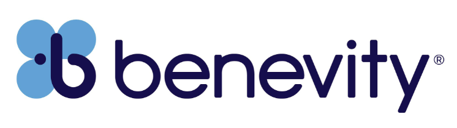

<p align="center">
  <a href="https://www.linkedin.com/in/sunny-r-panchal/"></a>
  <a href="mailto:sunnypanchalin@gmail.com"></a>
  
</p>

<p align="center"><em>Automating today so we can innovate tomorrow.</em></p>

---

### 🏢 &nbsp;Companies I've Built AI For

<p align="center">
  <a href="https://benevity.com"></a>
  &nbsp;&nbsp;&nbsp;&nbsp;&nbsp;&nbsp;&nbsp;&nbsp;
  <a href="https://www.honda.ca/"></a>
  &nbsp;&nbsp;&nbsp;&nbsp;&nbsp;&nbsp;&nbsp;&nbsp;
  <a href="https://www.ltimindtree.com/"></a>
  &nbsp;&nbsp;&nbsp;&nbsp;&nbsp;&nbsp;&nbsp;&nbsp;
</p>

---

### ⚡ &nbsp;What I Do

```
🎯  NOW        →  Building Agentic GenAI systems at Benevity (CSR, ESG, employee engagement)
🏎️  HONDA      →  Warranty Claim Classification · PDCA AI Summaries · MDM Customer Matching
💻  LTIMINDTREE →  Enterprise ML pipelines & AI automation at scale
🏥  BOH PHARMA →  Healthcare ML — early cancer detection with 92% precision
```

---

### 🧠 &nbsp;Tech I Work With

**GenAI & LLMs**


**ML & Data Science**


**DevOps & Data**


---

### 🔥 &nbsp;What I've Shipped

| | Project | Impact |
|---|---|---|
| 🤖 | **Agentic PDCA Assistant** — RAG app summarizing 200+ project decks/week | Executives save hours of reading |
| 🔧 | **Warranty Claim Classifier** — Hybrid ML + GenAI classification | **10–20 hrs/day** saved for QE team |
| 📋 | **DevOps Release Notes Agent** — Multi-agent auto release notes | Audience-specific docs, zero manual effort |
| 🎯 | **MDM Customer Matching** — Customer deduplication model | **99% precision**, 25% less manual work |
| 🏥 | **Cancer Detection ML** — Early-stage detection models | **92% precision** in clinical validation |

---

### 📊 &nbsp;GitHub

<p align="center">
  
  
</p>

<p align="center">
  
</p>

---

<p align="center">
  <em>Always building. Always learning. Always keeping it real.</em><br/>
  <em>Let's talk about GenAI, Agentic AI, or real-world AI engineering.</em>
</p>


